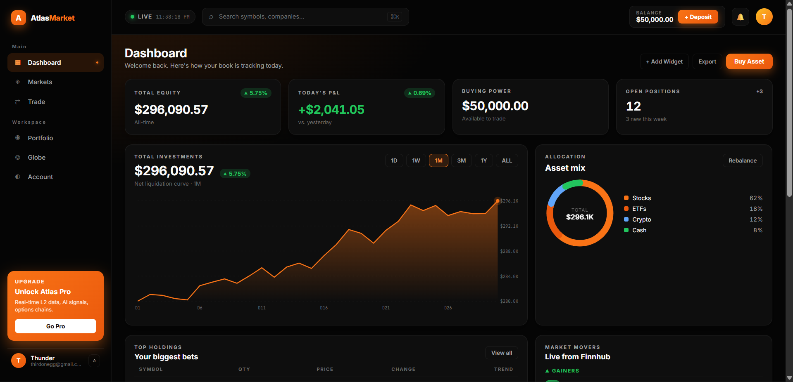
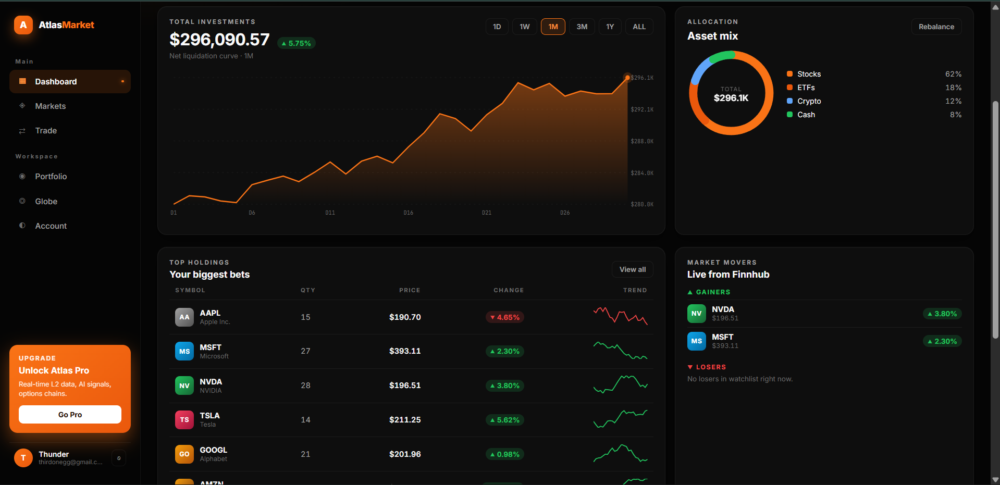
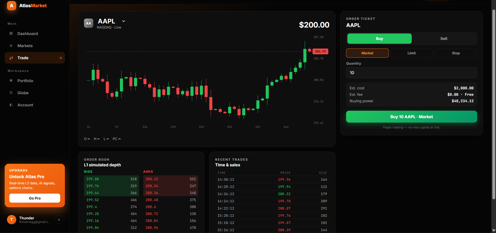
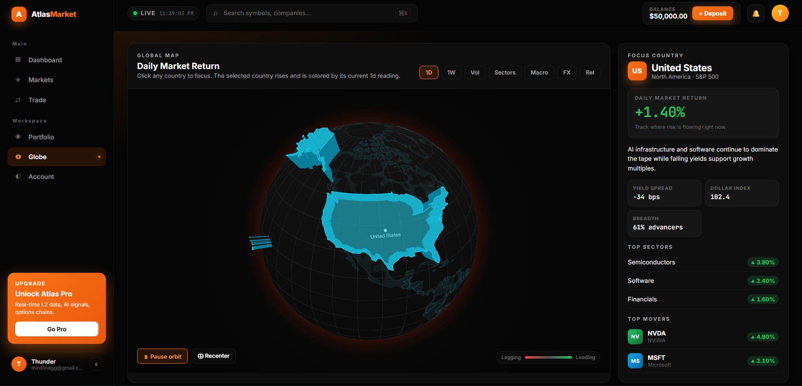
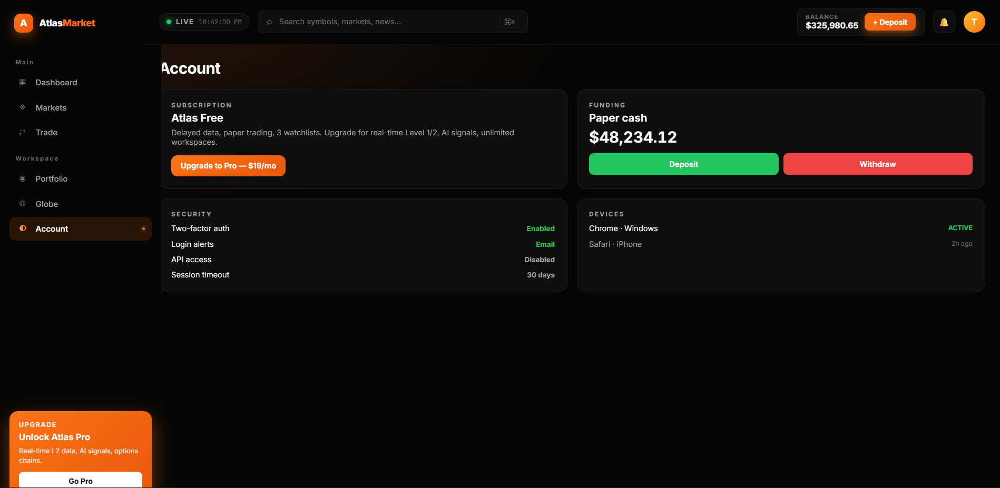

# AtlasMarket — End-to-End Global Stock Exchange Platform

AtlasMarket is a production-ready, globe-first stock exchange and market-intelligence terminal. It combines a premium responsive web UI, live Finnhub market data, Stripe-powered billing, a full paper-brokerage engine, an auth-gated session, and a minimalist 3D world globe — all built on a shared Expo / React-Native codebase with a zero-dependency Node.js gateway.

<p align="center">
  
</p>

---

## ✨ Highlights

- **Premium black + orange UI** — sidebar navigation, sticky top bar with LIVE status clock, command-K symbol search, responsive grid that collapses gracefully on narrower viewports.
- **Real live market feed** — Finnhub quotes + OHLC + news proxied through the platform API, refreshed every 15 s. Your API key never touches the browser.
- **Full paper brokerage** — Buy / Sell with Market, Limit and Stop orders. Every fill persists to the backend; positions, orders and fills survive reloads and follow you across devices.
- **Stripe Checkout wired end-to-end** — Upgrade-to-Pro subscription flow plus $100 / $500 / $2,500 deposit tiles, all using inline `price_data` so you don't need to pre-create a Stripe Price.
- **Auth gate** — email + password login / registration, JWT-style bearer sessions persisted in `localStorage`, server-side revocation on sign-out.
- **Clean minimalist globe** — matte-black sphere with orange atmosphere, single-selection highlight, click-to-focus with a compact info panel (macro stats, top sectors, movers).
- **Live news** — real Finnhub headlines power the Dashboard newswire and a symbol-specific news rail on the Trade page.
- **Notifications + toasts** — every user action (orders, cancels, Stripe errors, wire status) flows through a unified toast system with a persistent dropdown feed.

---

## 🧭 Product tour

### Dashboard
Your command center. KPI cards (Total Equity, Today's P&L, Buying Power, Open Positions), an equity curve with 1D / 1W / 1M / 3M / 1Y / ALL timeframes, an allocation donut derived from your real book, and a top-holdings table with sparklines and live prices.

<p align="center">
  
</p>

### Trade
Candlestick chart with real axes, a last-close price pill, O/H/L/PC readout, L1 order book, time-and-sales tape, and an order ticket that lets you Buy or Sell with Market / Limit / Stop flow. Orders persist to the backend workspace and refresh the rest of the app instantly.

<p align="center">
  
</p>

### Globe
A deliberately minimal 3D world map. No flow arcs, no pulse rings, no label clutter — only the selected country rises, and a tidy info panel on the right shows the current metric, a summary, macro stats, top sectors, and top movers. Seven metrics to choose from (Daily / Weekly return, Volatility, Sector strength, Macro sentiment, FX, Relative performance).

<p align="center">
  
</p>

### Account
Profile card with session details, Stripe subscription flow, paper-cash funding tiles ($100 / $500 / $2,500 via Checkout), security toggles, active devices.

<p align="center">
  
</p>

### Markets · Portfolio
- **Markets** — global indices strip (SPX, DJI, IXIC, RUT, VIX, DXY), a live Finnhub watchlist table (O/H/L + delta + trend), and a sector heatmap with an intensity gradient legend.
- **Portfolio** — real positions with mark-to-market P&L, open orders with one-click cancel, recent fills with timestamps. Empty state prompts new users toward the Trade page.

---

## 🚀 Quick start

```bash
# 1. Install dependencies
npm install

# 2. Configure environment (see "API keys" section below)
cp .env.example .env
cp platform-api/.env.example platform-api/.env
# then edit both .env files and paste your API keys

# 3. Start the secure backend (port 8787)
npm run platform:api

# 4. In a second terminal, start the web terminal (port 19006)
npm run web
```

Open `http://localhost:19006`, register a new account on the sign-in screen, and you're live.

---

## 🔑 API keys — what you need and where to get them

These are the **only** pieces of configuration you need to supply. Every integration point is already wired in code.

### 1. Finnhub — market data + news (**required for live data**)

- Sign up (free tier): **https://finnhub.io/register**
- Dashboard / copy key: **https://finnhub.io/dashboard**
- Paste into `platform-api/.env`:
  ```env
  MARKET_DATA_API_KEY=your-finnhub-key
  ```

> Skipping this makes the market-data proxy idle — the app still runs against bundled historical snapshots so you can demo the UI without a key.

### 2. Stripe — billing + funding (**required for Checkout**)

- Create account: **https://dashboard.stripe.com/register**
- Secret + publishable keys: **https://dashboard.stripe.com/apikeys**
- (Optional) Create a recurring Price: **https://dashboard.stripe.com/products** — AtlasMarket also supports inline `price_data`, so you can skip this.
- Webhook endpoint — URL: `https://<your-api-host>/v1/webhooks/stripe`: **https://dashboard.stripe.com/webhooks**

Paste into `platform-api/.env`:
```env
STRIPE_SECRET_KEY=sk_test_...
STRIPE_WEBHOOK_SECRET=whsec_...
# STRIPE_PRICE_ID is optional — the client passes inline priceData for both
# subscription and one-shot payments.
```

And into the client `.env`:
```env
STRIPE_PUBLISHABLE_KEY=pk_test_...
```

For local webhook testing install the Stripe CLI (**https://stripe.com/docs/stripe-cli**):
```bash
stripe listen --forward-to localhost:8787/v1/webhooks/stripe
```

Use Stripe's test card **`4242 4242 4242 4242`** with any future expiry / CVC.

---

## 🧱 Architecture

```text
┌────────────────────────────────────────────────────────────────────┐
│  Browser  (Expo / React Native Web)                                │
│  ─────────────────────────────────────────────────────────────     │
│   components/PremiumApp.tsx  ──  Shell + 6 pages + auth gate       │
│   components/AtlasMarketGlobeWeb.tsx  ──  Three.js globe           │
│   utils/*  ──  Charts, data adapters, globe math                   │
└───────────────────────────────┬────────────────────────────────────┘
                                │  HTTPS / bearer token
┌───────────────────────────────▼────────────────────────────────────┐
│  platform-api/server.js  (zero-dependency Node.js gateway)         │
│  ─────────────────────────────────────────────────────────────     │
│   /v1/auth/*         ──  register, login, me, logout               │
│   /v1/workspaces/*   ──  load + persist the paper book             │
│   /v1/market/*       ──  Finnhub quote / candle / news proxy       │
│   /v1/payments/*     ──  Stripe Checkout + Customer Portal         │
│   /v1/webhooks/*     ──  Stripe webhook ingestion + signature      │
└───────────────────────────────┬────────────────────────────────────┘
                                │  Outbound provider calls
                   ┌────────────▼──────────────┐
                   │  Finnhub      ·   Stripe  │
                   └───────────────────────────┘
```

- **Client** — one monolithic `PremiumApp.tsx` with a design-token system (`T`), inline CSS-in-JS, Inter + JetBrains Mono via Google Fonts.
- **Backend** — zero-dependency Node (no Express, no npm install for the server), JSON file store for users / sessions / workspaces / audit events.
- **Secrets** — Finnhub key, Stripe secret, webhook secret never leave the server.

---

## 📁 Project structure

```text
├── App.tsx                 # Root — NativeBase provider + PremiumApp
├── components/
│   ├── PremiumApp.tsx       # Full new UI (shell + 6 pages + auth)
│   ├── AtlasMarketGlobeWeb.tsx  # Three.js globe (legacy, still used)
│   └── …                    # Legacy screens kept for reference
├── utils/                   # Market data, globe math, formatters
├── platform-api/
│   ├── server.js            # Zero-dep Node gateway
│   └── .env.example         # Backend env template
├── docs/assets/             # Screenshots
├── types/                   # Shared TypeScript domain model
└── webpack.config.js        # Expo webpack config with Workbox PWA
```

---

## 🧰 Scripts

| Command                   | What it does                                   |
|---------------------------|------------------------------------------------|
| `npm install`             | Install dependencies                           |
| `npm run platform:api`    | Start the Node gateway on `:8787`              |
| `npm run web`             | Start the Expo web terminal on `:19006`        |
| `npm start`               | Start Expo (QR for iOS / Android)              |
| `npm run ts:check`        | Strict TypeScript validation                   |
| `npm test`                | Run the Jest test suite                        |
| `npm run platform:test`   | Run platform-api integration tests             |

---

## 🚢 Deployment

- **Client (web)** — `expo export:web` produces a static bundle. Deploy to Vercel, Netlify, Cloudflare Pages, S3/CloudFront, anywhere.
- **Platform API** — the Node server is dependency-free; any Node host works (Render, Railway, Fly.io, Cloud Run). A `render.yaml` blueprint is included.
- **Mobile** — `expo build:android` / `expo build:ios` or EAS Build.

Make sure `ATLASMARKET_API_BASE` in the client points at your deployed API, and your Stripe webhook endpoint in the dashboard points at `https://<your-api>/v1/webhooks/stripe`.

---

## 🔒 Security notes

- Finnhub key and Stripe secret live only on `platform-api`.
- Client only sees the Stripe **publishable** key.
- Sessions are opaque bearer tokens with server-side revocation at `/v1/auth/logout`.
- Stripe webhooks verify signatures with `STRIPE_WEBHOOK_SECRET`.
- The paper-brokerage engine is strictly simulated — no live trading is performed.

---

## 📜 License

See [LICENSE](./LICENSE).
